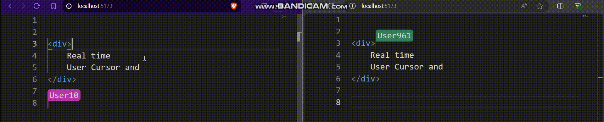

# real-time-monaco

## Demo

Check out the demo app: [real-time-monaco Demo](https://real-time-monaco.vercel.app/)
---
A real-time collaborative code editor component using Monaco Editor and Yjs for state synchronization.

## Features

- Real-time collaboration with multiple users.
- User cursors and selections highlighting.
- Easy integration with React applications.

## Installation

```bash
npm install real-time-monaco
```

## Usage

```tsx
import React from 'react';
import { RealTimeMonaco } from 'real-time-monaco';

const App = () => {
  return (
    <RealTimeMonaco
      height='100vh'
      width='100vw'
      name="YourName"
      roomId="unique-room-id"
      color="#ff0000"
    />
  );
};

export default App;
```

## Props

| Prop   | Type   | Description                        |
| ------ | ------ | ---------------------------------- |
| name   | string | The name of the user.              |
| roomId | string | The unique ID for the collaboration room. |
| color  | string | The color used to represent the user. |

## License

MIT License

---
